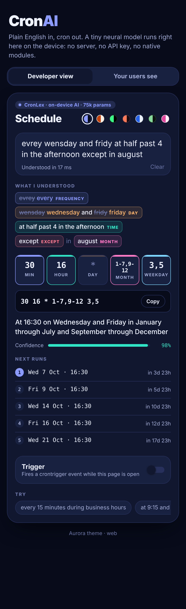
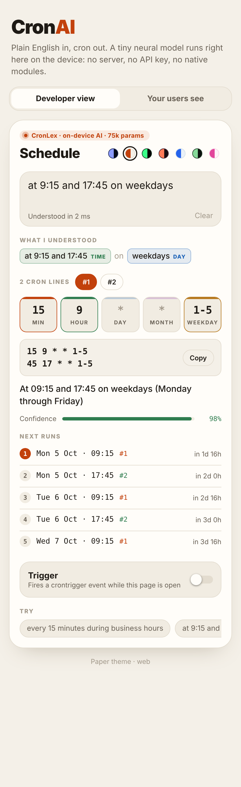
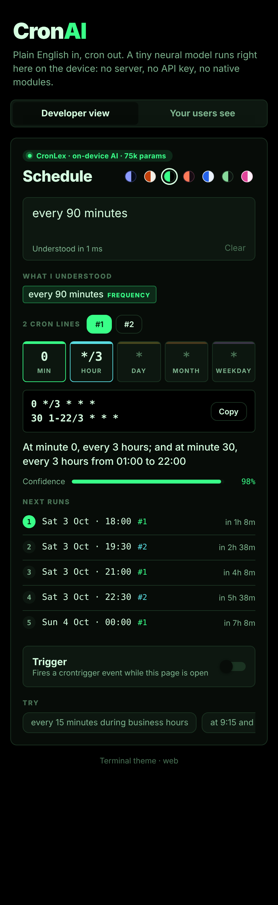
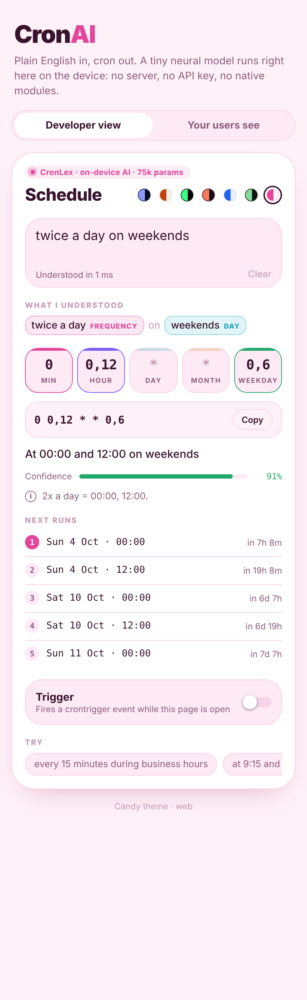
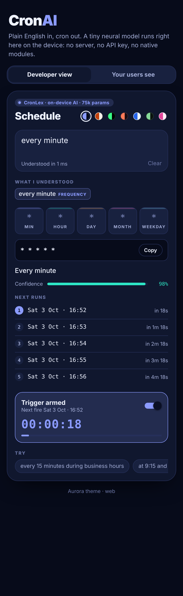
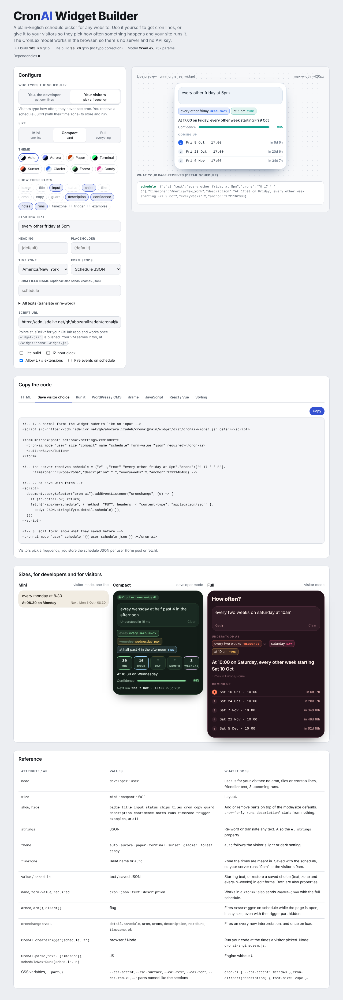

# CronAI

A beautiful, themeable **React Native cron trigger component** that turns plain-English schedules into cron expressions using **CronLex**, a tiny on-device AI model. It also ships as a **drop-in web widget** (`<cron-ai>`) for any website. No server, no API key, no native modules, no extra packages: the model weights live inside the source code and run in pure TypeScript.

**Try it live:** [CronAI on CodePen](https://codepen.io/Abozar-Alizadeh/pen/MYpELpx) · [30-second demo video](docs/media/cronai-linkedin-4x5.mp4)

> The demo video is stored with [Git LFS](https://git-lfs.com). Run `git lfs install` once before cloning to get the real file instead of a pointer.



```
"evrey wensday and fridy at half past 4 in the afternoon except in august"
        ↓  (≈10 ms, fully offline)
30 16 * 1-7,9-12 3,5     At 16:30 on Wednesday and Friday in January through July and September through December
```

## Highlights

- **Complex schedules**: windows ("every 10 min from 9 to 5"), exclusions ("except in august"), Nth weekdays ("second tuesday of the month"), last day / last Friday, seasons, holidays, "twice a day", "every 90 minutes" (split into several cron lines automatically), "quarter to 10", "17h30", and more.
- **Typo tolerant**: CronLex, a 75k-parameter neural network (int8, ~75 KB) maps misspelled words to the schedule vocabulary. On the typo benchmark it lifts exact-match accuracy from **16.9% to 93.8%** (`npm run eval`).
- **Every N weeks, done right**: cron can't skip weeks, so "every two weeks on saturday" returns the weekly line plus a **week guard** (`result.guard`): a ready crontab line (`0 0 * * 6 [ $(( ($(date +\%s) - ANCHOR) / 604800 \% 2 )) -eq 0 ] && cmd`), a JS check, the start date, and next runs/trigger that really skip the off weeks. Save `guard.anchor` and pass it back as `anchor` to keep the same weeks. Also offers `6#1,6#3` (1st and 3rd Saturday) as a guard-free alternative.
- **Honest**: every default is listed as an *assumption*, and anything cron can't express (every 30 seconds, every 2 years) comes back as a *warning* with the closest approximation.
- **7 themes**: Aurora, Paper, Terminal, Sunset, Glacier, Forest, Candy, plus `createTheme()` for your own.
- **Live trigger**: arm it and `onTrigger` fires on schedule while the app is open, with a countdown.
- **Explainable UI**: colour-coded "what I understood" chips, per-field tiles, plain-English description, confidence meter, next 5 runs.
- Works on **iOS, Android and web** (react-native-web). Zero runtime dependencies beyond React Native.

| Paper | Terminal | Candy | Armed |
|---|---|---|---|
|  |  |  |  |

## Embed it on any website

One script tag, then the tag anywhere. No framework, no build step. Three sizes:

| `size="mini"` | `size="compact"` | `size="full"` |
|---|---|---|
| one input line + the cron under it | card with chips, tiles, description, next run | everything + next 5 runs, notes, live trigger |

```html
<script src="https://cdn.jsdelivr.net/gh/abozaralizadeh/cronai@master/widget/dist/cronai-widget.js" defer></script>

<cron-ai size="compact" theme="auto" value="every weekday at 9am" name="schedule"></cron-ai>
```

- **Builds** (`npm run build:widget` → `widget/dist/`): `cronai-widget.js` (IIFE, ~100 KB gzip, with CronLex), `cronai-widget.esm.js` (ES module), `cronai-widget.lite.js` (~25 KB gzip, exact words only, no typo correction), `embed.html` (iframe page).
- **Themes**: `auto` (follows the visitor's light/dark) plus the 7 palettes. Restyle with CSS variables: `cron-ai { --cai-accent: #e11d48; --cai-font: inherit }`, or `::part(card|input|cron|tiles|copy)`.
- **Forms**: it is form-associated, so inside a `<form>` it submits the cron line(s) under `name` (supports `required`).
- **Events**: `cronchange` (`detail.cron`, `crons`, `description`, `confidence`, `ok`) and `crontrigger` (full size, when `armed`).
- **CMS that strips tags**: `<div data-cronai data-size="mini" data-target="#my-input"></div>`.
- **No scripts allowed**: `<iframe src=".../embed.html?size=compact&theme=auto&value=...">`; it posts `change` and `resize` messages to the parent.
- **JS**: `CronAI.mount('#el', { size, theme, value, onChange })`, headless `CronAI.parse(text)`.
- **React / Vue**: render `<cron-ai>` like any element and listen for `cronchange`.
- Self-hosted: the VM server exposes `/widget/cronai-widget.js` and `/embed`.

The jsDelivr URL works once `widget/dist` is pushed to GitHub (it's intentionally not git-ignored). `widget/builder.template.html` → `widget/dist/builder.html` is an interactive embed-code builder.



## Let your visitors pick a frequency

Not everyone wants a cron line. If your site needs to *do* something at a frequency your users choose (send a reminder, refresh a report, post a digest), use visitor mode. They type "every other friday at 5pm" and never see cron; you get a small schedule JSON to store and run.

```html
<form method="post" action="/settings/reminder">
  <cron-ai mode="user" size="compact" name="reminder" form-value="json" required></cron-ai>
  <button>Save</button>
</form>
```

Your server receives:

```json
{ "v": 1, "text": "every other friday at 5pm", "crons": ["0 17 * * 5"], "timezone": "Europe/Rome",
  "description": "At 17:00 on Friday, every other week starting Fri 9 Oct", "everyWeeks": 2, "anchor": 1791140400 }
```

Run it wherever you like. The visitor's time zone and "every N weeks" are applied for you:

```js
// browser, while the page is open
CronAI.createTrigger(saved, ({ date }) => showReminder());

// Node backend, for every user (widget/dist/cronai-engine.esm.js has no DOM)
import { createTrigger, scheduleNextRuns } from './cronai-engine.esm.js';
createTrigger(user.schedule, () => sendReminder(user.id));
const [next] = scheduleNextRuns(user.schedule, 1);   // or enqueue in your own job runner
```

Restore it in an edit form with `<cron-ai mode="user" schedule='…saved json…'>` (or `el.schedule = saved`). Server API: `GET /api/next?schedule=<json>&n=5`.

### Make it yours

Everything visible can be changed, in the web widget and the React Native component alike:

| What | Web widget | React Native |
|---|---|---|
| Audience | `mode="developer"` (default) or `"user"` | `mode` |
| Layout | `size="mini \| compact \| full"` | (full) |
| Which parts show | `show` / `hide` with any of `badge title input status chips tiles cron copy guard description confidence notes runs timezone trigger examples` (also `all`, `show="only …"`) | `show` / `hide` arrays (+ `themes`) |
| Every text | `strings='{"heading":"Ogni quanto?","nextRuns":"Prossime"}'` or `el.strings = {…}` | `strings` |
| Time zone | `timezone="Europe/Rome"` (default: visitor's) | `timezone` |
| Form output | `name`, `form-value="cron \| json \| text \| description"`, `required` | `onScheduleChange(schedule)` |
| Restore | `schedule='{…}'` / `el.schedule = saved` | `defaultSchedule` |
| Look | `theme`, CSS variables `--cai-*`, `::part(<section>)` | `theme`, `createTheme()` |
| Live trigger | `armed` / `arm()` / `crontrigger` event, works with the trigger part hidden | `armed` / `onTrigger`, or `useCronTrigger(schedule)` |

## Free hosting on GitHub Pages

The Widget Builder, the demo and the widget scripts are static files, so GitHub Pages hosts them for free (public repo).

1. Push the repo to GitHub (public).
2. **Settings → Pages → Build and deployment → Source: GitHub Actions.**
3. Push to `main` or `master` (or run the workflow by hand from the Actions tab). `.github/workflows/pages.yml` runs the tests, builds everything with `npm run build:pages` and deploys `site/`.

You get:

| URL | What |
|---|---|
| `https://abozaralizadeh.github.io/cronai/` | Widget Builder (its copy-paste code points at this site) |
| `https://abozaralizadeh.github.io/cronai/demo/` | React Native component demo |
| `https://abozaralizadeh.github.io/cronai/widget/cronai-widget.js` | the script to embed on any site (also `.lite.js`, `.esm.js`, `cronai-engine.esm.js`, `embed.html`) |

Preview locally: `npm run build:pages && npx serve site` (or any static server). For a custom domain or a user site, build with `SITE_BASE=/`.

## Quick start

```bash
npm install
npm run web        # Expo web
npm run ios        # or android
npm test           # 70 engine tests
```

Use it in your app by copying `src/` (it only imports `react` and `react-native`):

```tsx
import { CronTrigger } from './src';

<CronTrigger
  theme="aurora"                      // or 'paper' | 'terminal' | 'sunset' | 'glacier' | 'forest' | 'candy' | createTheme(...)
  defaultValue="every weekday at 9am"
  onChange={(r) => r.ok && save(r.crons)}  // r.crons: string[]
  onTrigger={({ date, cron }) => runJob()}  // fires while armed + app in foreground
/>
```

Headless (no UI):

```ts
import { parseSchedule, describeCron, nextRuns } from './src/engine';

const r = parseSchedule('last friday of every month at 6pm');
r.crons        // ['0 18 * * 5L']
r.description  // 'At 18:00 on the last Friday of the month'
r.nextRuns     // [{ date, cron }, ...]
r.warnings / r.assumptions / r.corrections / r.confidence
```

### Props

| Prop | Type | Default | |
|---|---|---|---|
| `defaultValue` / `value` / `onChangeText` | `string` | sample text | uncontrolled or controlled text |
| `onChange` | `(r: ParseResult) => void` | | every new interpretation |
| `onTrigger` | `(e: {date, cron, schedule, count, late, result}) => void` | | fires on schedule when armed |
| `theme` / `onThemeChange` | `ThemeName \| CronTheme` | `'aurora'` | picker shows when `onThemeChange` is set |
| `armed` / `defaultArmed` / `onArmedChange` | `boolean` | `false` | |
| `allowExtensions` | `boolean` | `true` | allow `L`, `5L`, `1#2` (Quartz / cron-parser / AWS / node-cron) |
| `hour12` | `boolean` | `false` | 12-hour descriptions |
| `examples` | `string[] \| false` | built-in | tappable example chips |
| `mode` | `'developer' \| 'user'` | `'developer'` | `user` = for your app's users: no cron jargon |
| `show` / `hide` | `Section[]` | per mode | add / remove parts (see table above) |
| `strings` | `Partial<Strings>` | English | re-word or translate anything |
| `timezone` | IANA string | device zone | |
| `defaultSchedule` | `SavedSchedule \| string` | | restore a saved choice |
| `onScheduleChange` | `(s: SavedSchedule \| null) => void` | | store this per user |
| `anchor`, `nextCount`, `debounceMs`, `style` | | | |

## How it works

```
text ─► tokenizer ─► exact lexicon ─► tiny neural model (unknown words) ─► semantic matchers ─► cron compiler
                                     + edit-distance sanity check        (times, windows,       (always valid,
                                                                          intervals, days…)      multi-line, warnings)
```

1. **Tokenizer** understands `9:30`, `9.30pm`, `17h30`, `:15`, `1st`, `mon-fri`, `twenty-five`.
2. **CronLex** (`src/engine/model`), the tiny model: hashed character n-grams → 32-d embedding bag → 64 ReLU → softmax over 117 schedule words + `__other__`. Trained in ~25 s on synthetic keyboard typos (`training/train_model.py`, numpy only) and exported as int8 base64 into `weights.ts`. A Levenshtein check rejects implausible corrections.
3. **Interpreter** (`interpret.ts`): 17 pattern matchers produce a structured meaning (times, windows, intervals, day/month sets, exclusions…).
4. **Compiler** (`compile.ts`): deterministic, so the output is always valid cron; groups times into the fewest cron lines.

Why not an on-device LLM? Even a "small" one is hundreds of MB, needs a native runtime (an extra integration), and can hallucinate invalid cron. This design keeps the AI where it helps (fuzzy language) and stays exact where it matters.

## Backend / demo server

`server/index.ts` serves the single-file web demo of the real component plus a JSON API:

```
GET /api/parse?q=every+15+minutes+during+business+hours[&ext=0][&h12=1]
GET /api/health
```

On a VM: `./setup_service.sh` (idempotent: installs Node, deps, tests, builds, installs and restarts the `cronai` systemd service). Logs: `journalctl -u cronai -f` and a size-capped `logs/cronai.log` (1 MB × 3) you can copy locally.

## Scripts

| | |
|---|---|
| `npm test` | engine test-suite (node:test) |
| `npm run typecheck` | TypeScript |
| `npm run eval` | typo-robustness benchmark, with vs without the model |
| `npm run train` | retrain the model → `src/engine/model/weights.ts` |
| `npm run build:demo` | single-file react-native-web build → `web/dist/index.html` |
| `npm run build:pages` | everything above + full-page builder → `site/` (what GitHub Pages serves) |
| `npm run build:widget` | embeddable widget builds + iframe page + builder → `widget/dist/` |
| `npm run test:widget` | Playwright end-to-end check of the widget (sizes, events, form, CMS mount, iframe, lite) |
| `npm run server` | demo + API on :8080 |
| `npx tsx scripts/try.ts "every other day at noon"` | quick CLI |

## Limitations

- The trigger runs in JS while the app is alive. For background execution, hand `crons` to your backend or a native scheduler.
- English only. Seasons assume the northern hemisphere.
- Standard cron can't do "every 2 weeks" on its own; use the guarded crontab line from `result.guard` (or the widget's guard box). Sub-minute intervals and "13th AND Friday" get a warning and the nearest schedule.
