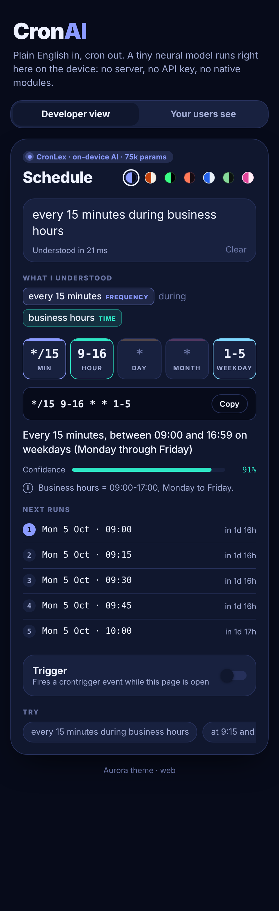
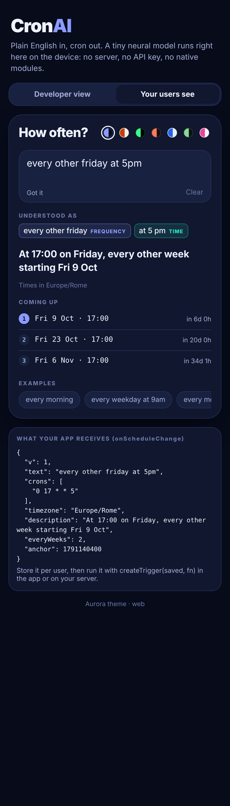

# The story of CronAI

*Material for blog posts and social media. Screenshots live in `docs/screenshots/`.*

## The one-liner

I wanted a scheduling field where you just type "every wensday and fridy at half past 4 in the afternoon except in august" and get valid cron back. No server, no API key, no model download. So I built a React Native component with a neural network small enough to ship inside the source code.

## Why

Cron is powerful and unreadable. Every app that schedules something (backups, reminders, reports, IoT jobs) either forces users through a five-dropdown form or makes them learn `*/15 9-16 * * 1-5`. LLMs can translate English to cron, but they need a network call or a 500 MB on-device runtime, and they sometimes invent cron that doesn't parse.

The constraint I set: **small local AI, integrated in the code, zero extra integrations.**

## The build, day one (2 Oct 2026)

**1. Split the problem.** Language is fuzzy, cron is exact. So the AI handles the fuzzy part (what did the user mean by "wensday", "evrey", "aftrenoon"?) and a deterministic compiler handles the exact part. The output can never be invalid cron.

**2. A 75k-parameter model.** Each word becomes a bag of hashed character n-grams, then a 32-dimension embedding, a 64-unit hidden layer and a softmax over 117 schedule words plus "not a schedule word". Trained in about 25 seconds with plain numpy on synthetic keyboard typos (neighbour-key swaps, deletions, transpositions, phonetic slips) plus a list of real-world misspellings. Quantised to int8 and pasted into a TypeScript file as base64. Inference is about 30 lines of TS.

**3. A second opinion.** Early on the model decided "holidays" meant "friday". Fix: every correction must also pass an edit-distance check. Model proposes, Levenshtein disposes.

**4. Seventeen pattern matchers.** Times (`9:30`, `17h30`, `quarter to 10`, `half past 4`), windows (`from 9 to 5`, `during business hours`), intervals (`every 90 minutes`, `twice a day`), Nth weekdays (`second tuesday of the month`), last-day rules, exclusions, seasons, even Christmas.

**5. Be honest about cron's limits.** "Every 2 weeks" can't be expressed in cron. Instead of silently doing something wrong, the component shows a warning and the closest schedule. Every default it picks ("no time given, so midnight") is listed as an assumption.

**6. Make it beautiful.** Seven themes (Aurora, Paper, Terminal, Sunset, Glacier, Forest, Candy), colour-coded chips that show what the model understood, animated field tiles, a confidence meter, the next five runs, and a live trigger with a countdown.

## Numbers worth sharing

- **93.8% vs 16.9%**: exact cron match on 178 typo-corrupted sentences, with vs without the tiny model.
- **75,318 parameters**, about **75 KB** of int8 weights, **~1-15 ms** per sentence.
- **70 golden tests**, 0 native dependencies, runs on iOS, Android and web.
- "every 90 minutes" becomes two cron lines automatically: `0 */3 * * *` and `30 1-22/3 * * *`.

## Challenges

- **"every two weeks on saturday" vs "every saturday"**: a tester noticed both gave `0 0 * * 6`. Cron simply can't skip weeks, and a warning is easy to miss. Now CronAI keeps the weekly line but adds a week guard: a crontab line that checks which week it is, a matching JS check, a fixed start date, and next runs and trigger that really skip the off weeks. Picking the week boundary took care: Monday 00:00 sounds natural, but a midnight-Monday job would flip weeks when daylight saving changes, so the boundary sits 3 hours earlier.

- **"9 to 5"**: bare numbers are ambiguous. The range logic infers PM for the end only when it's smaller than the start and both look like 12-hour times; "22 to 2" stays an overnight window.
- **"every second"**: unit or ordinal? "every second tuesday of the month" is 2#2, "every 30 seconds" is a warning.
- **"at 11" vs "every night at 11"**: day parts act as AM/PM context, otherwise the 24-hour reading is kept and flagged.
- **Rendering on web**: the web demo is the real component compiled with react-native-web and esbuild into a single 570 KB HTML file.

## Screenshots

| | |
|---|---|
|  | Aurora theme, default sentence |
|  | Typos corrected live, struck-through originals |
|  | Terminal theme, "every 90 minutes" split into 2 lines |
|  | Trigger armed with countdown |

## Post ideas

- "I shipped a neural network inside a .ts file." Thread on the hashing trick + int8 + 30-line inference.
- "Model proposes, Levenshtein disposes." On guarding tiny models with classic algorithms.
- "Cron can't do every 2 weeks." A short post on cron's blind spots and why tools should warn instead of guess.
- Before/after GIF: typing with typos, chips turning colour as words are understood.

## Day two: a name and a gadget

The model got a name: **CronLex** (cron + lexicon, because its whole job is mapping messy words onto the schedule vocabulary).

Then the obvious question: why only React Native? The engine is plain TypeScript, so the same brain now ships as a web component. One script tag and `<cron-ai>` works on any website, in three sizes:

- **mini**: a single input line with the cron underneath, for forms and settings pages
- **compact**: a small card with the colour-coded chips and field tiles
- **full**: everything, including next runs and a live trigger

It works inside normal HTML forms, in WordPress-style editors that strip custom tags (`
`), and as an iframe for site builders that block scripts. A lite build drops the model and comes in at about 25 KB gzipped.

Fun detail: the widget and the React Native component share the exact same engine and colour palettes, so a cron typed on the website and in the app always match.

## Day two, part three: for the people who never want to see cron

Feedback: plenty of site owners don't want a cron line at all. They want their visitors to choose "how often" (a reminder, a digest, a report) and then have the site act on it.

So the widget learned a second personality. `mode="user"` hides the cron, the field tiles and the crontab guard, rewrites the copy in plain language ("How often?", "Coming up") and hands the site a tiny JSON instead: the text, the cron lines, the visitor's time zone and, for "every other Friday", which weeks count. The same JSON runs anywhere with `createTrigger`, in the browser or on a Node server, so a visitor in New York who picks 9am gets 9am New York time even if the server lives in Frankfurt.

Then everything became a knob: every part of the UI can be shown or hidden by name, every string can be replaced (a translation is just a JSON object), the form can submit cron, JSON, the raw text or the description, and a saved choice can be loaded back into an edit form.

Hard part: time zones without shipping a time zone database. The engine walks calendar days as plain numbers and asks the browser's own `Intl` API what the wall clock says, which also handles daylight saving gaps (a 02:30 job on the night clocks spring forward is skipped, like real cron).

## Free hosting

Everything a visitor needs is static: one HTML page for the builder, one for the demo and a few JS files. So the whole thing deploys to GitHub Pages with a single workflow that runs the tests, builds the site and publishes it. The builder even notices where it's hosted, so its copy-paste snippets point at the same site that serves the widget.

## Progress log

- **2026-10-04**: demo video committed through Git LFS (`*.mp4`, `*.mov`, `*.webm` tracked in `.gitattributes`) so the repo history stays small.
- **2026-10-04**: 29 s LinkedIn demo video of the real widget (`docs/media/cronai-linkedin-4x5.mp4`, 1080x1350, cover `docs/media/cronai-linkedin-cover.png`). Recorded with `scripts/video/record.py` (Playwright CDP screencast + ffmpeg). LinkedIn can't embed CodePen, so native video is the way to show it there.
- **2026-10-04**: live CodePen demo (https://codepen.io/Abozar-Alizadeh/pen/MYpELpx) embedded in the Medium draft, right after the intro. Loads the widget from jsDelivr (`cronai@master`).
- **2026-10-04**: fixed widget CDN links (`cronai@main` → `cronai@master`, the repo's real branch); `@main` was a 404.
- **2026-10-03**: Medium post drafted ("I Put a Neural Network Inside a TypeScript File to Kill the Cron Expression"), unpublished, with 9 images: pipeline diagram, a 'type it however you like' examples card (`docs/screenshots/medium-examples.svg/.png`, real engine output), typo fixing, assumptions, every-two-weeks guard, 7-theme collage, widget sizes, visitor mode + JSON, armed trigger.
- **2026-10-03**: free hosting on GitHub Pages (workflow + `npm run build:pages`): builder at the root, demo at /demo, widget scripts at /widget.
- **2026-10-03**: visitor mode, show/hide for every part, translatable strings, time zones, SavedSchedule JSON + createTrigger for browsers and Node, form-value options, /api/next. 85 engine tests, 32 widget checks.
- **2026-10-03**: "every N weeks" now returns a week guard (crontab line + JS check + correct next runs/trigger) instead of silently behaving like weekly; +9 engine tests, +5 widget checks.
- **2026-10-03**: model named CronLex. Embeddable `<cron-ai>` web widget (mini/compact/full, auto + 7 themes, full/lite/ESM builds, iframe, CMS mount, form support), embed-code builder page, 13 widget e2e checks.
- **2026-10-02**: v1.0. Engine, model, component, 7 themes, live trigger, web demo, API server, VM setup script, 70 tests, typo benchmark.
